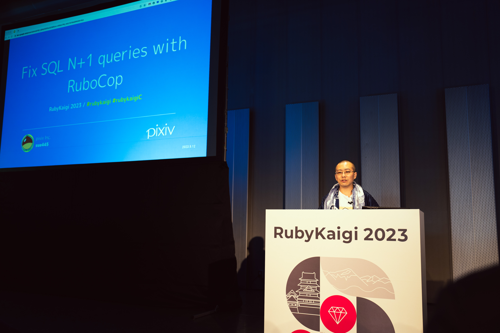

# rubicure 10th Anniversary
[TokyuRuby会議14](https://tokyurubykaigi.github.io/tokyu14/) #tqrk14

@sue445

---
## 自己紹介
@sue445

---
## RubyKaigi 2023 Speaker 💎

---
## 今日話すこと
* これまでのrubicure
* これからのrubicure

---
## rubicureについて
* https://github.com/sue445/rubicure
* プリキュアのRuby実装
* 2013/12/15: v0.0.1 🎂
* 2023/06/04: v3.2.1 (Latest)
* 今年10周年 🎉

---
## Versioning Policy
* rubicure uses **Semantic Cure Versioning** ❤️
  * https://github.com/sue445/rubicure#versioning-policy
* 基本的には普通のSemantic Versioningと同じだが、新しいプリキュアシリーズの追加の時はMinor versionを行う
  * e.g. 1.1.1 -> 1.2.0

---
## 主要機能の紹介
* 実際に動くのを見てもらうのが早いと思うので見せます

---
## 現在のプリキュアを取得
<iframe class="playground" src="https://rubicure-playground-lczknh2o4a-an.a.run.app/play?readonly=false&editor_height=8em&font_size=24&input=Precure.now" />

---
## プリキュアのシリーズを取得
<iframe class="playground" src="https://rubicure-playground-lczknh2o4a-an.a.run.app/play?readonly=false&editor_height=8em&font_size=24&input=Precure.hirogaru_sky.title" />

---
## プリキュアがオンエア中か取得
<iframe class="playground" src="https://rubicure-playground-lczknh2o4a-an.a.run.app/play?readonly=false&editor_height=8em&font_size=24&input=Precure.hirogaru_sky.on_air%3F(%222023-07-29%22)" />

---
## プリキュアのシリーズに所属してるメンバーを取得
<iframe class="playground" src="https://rubicure-playground-lczknh2o4a-an.a.run.app/play?&readonly=false&editor_height=8em&font_size=24&input=Precure.hirogaru_sky.girls.map(%26%3Ahuman_name)%0APrecure.hirogaru_sky.girls.count%0A" />

---
## 特定のプリキュアを取得
<iframe class="playground" src="https://rubicure-playground-lczknh2o4a-an.a.run.app/play?readonly=false&editor_height=8em&font_size=24&input=Cure.sky.human_name%0ACure.sky.precure_name%0ACure.sky.birthday%0A" />

---
## ヒーローの出番です！
<iframe class="playground" src="https://rubicure-playground-lczknh2o4a-an.a.run.app/play?readonly=false&editor_height=8em&font_size=24&input=Cure.sky.name%0ACure.sky.transform!%0ACure.sky.name%0ACure.sky.attack!%0A" />

---
## トロプリは毎話名乗りがランダムなので再現
<iframe class="playground" src="https://rubicure-playground-lczknh2o4a-an.a.run.app/play?readonly=false&editor_height=8em&font_size=24&input=Cure.summer.transform!%0A" />

---
## レインボーパフュームいくニャン！
<iframe class="playground" src="https://rubicure-playground-lczknh2o4a-an.a.run.app/play?readonly=false&editor_height=8em&font_size=24&input=Cure.cosmo.transform!(%3Arainbow_perfume)" />

---
## フルネーム(キュアプリンセス)
<iframe class="playground" src="https://rubicure-playground-lczknh2o4a-an.a.run.app/play?readonly=false&editor_height=8em&font_size=24&input=Cure.princess.human_name%0ACure.princess.full_name%0A" />

---
## フルネーム(キュアスカーレット)
<iframe class="playground" src="https://rubicure-playground-lczknh2o4a-an.a.run.app/play?readonly=false&editor_height=8em&font_size=24&input=Cure.scarlet.human_name%0ACure.scarlet.full_name" />

---
## 全プリキュア（キュアエコー含む）
<iframe class="playground" src="https://rubicure-playground-lczknh2o4a-an.a.run.app/play?readonly=false&editor_height=8em&font_size=24&input=Precure.all_girls.count%0A" />

---
## プリキュアオールスターズ（映画のやつ）
<iframe class="playground" src="https://rubicure-playground-lczknh2o4a-an.a.run.app/play?readonly=false&editor_height=8em&font_size=24&input=Precure.all_stars.count%0APrecure.all_stars(%222013-10-26%22).count%0APrecure.all_stars(%3Adx).count%0APrecure.all_stars(%3Adx2).count%0APrecure.all_stars(%3Adx3).count%0APrecure.all_stars(%3Anew_stage).count%0APrecure.all_stars(%3Anew_stage2).count%0APrecure.all_stars(%3Anew_stage3).count%0APrecure.all_stars(%3Aspring_carnival).count%0APrecure.all_stars(%3Asing_together_miracle_magic).count%0APrecure.all_stars(%3Amemories).count%0A" />

---
## オールスターズがつかない映画
<iframe class="playground" src="https://rubicure-playground-lczknh2o4a-an.a.run.app/play?readonly=false&editor_height=8em&font_size=24&input=Precure.dream_stars.map(%26%3Aprecure_name)%0APrecure.super_stars.map(%26%3Aprecure_name)%0APrecure.miracle_universe.map(%26%3Aprecure_name)%0APrecure.miracle_leap.map(%26%3Aprecure_name)%0A" />

---
## ピカリンじゃんけん
<iframe class="playground" src="https://rubicure-playground-lczknh2o4a-an.a.run.app/play?readonly=false&editor_height=8em&font_size=24&input=Cure.peace.pikarin_janken%3B%20nil" />

---
## Not operator（悪落ち）
<iframe class="playground" src="https://rubicure-playground-lczknh2o4a-an.a.run.app/play?readonly=false&editor_height=8em&font_size=24&input=Cure.passion.name%0A!Cure.passion%0ACure.passion.name%0A" />

---
## Not operator（悪落ち）
<iframe class="playground" src="https://rubicure-playground-lczknh2o4a-an.a.run.app/play?readonly=false&editor_height=8em&font_size=24&input=Cure.beat.name%0A!Cure.beat%0ACure.beat.name%0A" />

---
## Not operator（悪落ち）
<iframe class="playground" src="https://rubicure-playground-lczknh2o4a-an.a.run.app/play?readonly=false&editor_height=8em&font_size=24&input=Cure.scarlet.name%0A!Cure.scarlet%0ACure.scarlet.name%0A" />

---
## Not operator（悪落ち）
<iframe class="playground" src="https://rubicure-playground-lczknh2o4a-an.a.run.app/play?readonly=false&editor_height=8em&font_size=24&input=Cure.finale.name%0A!Cure.finale%0ACure.finale.name%0A" />

---
## Color methods
<iframe class="playground" src="https://rubicure-playground-lczknh2o4a-an.a.run.app/play?readonly=false&editor_height=8em&font_size=24&input=Rubicure%3A%3AGirl.colors%0APrecure.all_girls.select(%26%3Apink%3F).map(%26%3Aprecure_name)%0APrecure.all_girls.count(%26%3Apink%3F)" />
-->

---
## Birthday methods
<iframe class="playground" src="https://rubicure-playground-lczknh2o4a-an.a.run.app/play?readonly=false&editor_height=8em&font_size=24&input=Precure.all_girls.select(%26%3Ahave_birthday%3F).count%0APrecure.all_girls.select(%26%3Ahave_birthday%3F).sort_by%20%7B%20%7Cgirl%7C%20Date.parse(girl.birthday)%20%7D.map%7B%20%7Cgirl%7C%20%5Bgirl.birthday%2C%20girl.human_name%5D%20%20%7D%0A" />

---
## 平成プリキュア vs 令和プリキュア
<iframe class="playground" src="https://rubicure-playground-lczknh2o4a-an.a.run.app/play?readonly=false&editor_height=8em&font_size=24&input=Cure.star.heisei%3F%0ACure.cosmo.reiwa%3F%0APrecure.all_girls.count(%26%3Aheisei%3F)%0APrecure.all_girls.count(%26%3Areiwa%3F)" />

---
## h2
<iframe class="playground" src="" />

---
## h2
<iframe class="playground" src="" />

---
## h2
<iframe class="playground" src="" />

---
## 
* text

---
## h2
* text

---
## h2
* text

---
## h2
* text

---
## playground (local)
<iframe class="playground" src="http://localhost:9292/play?editor_height=8em&font_size=24&input=puts%201%20%2B%202" />

---
## playground (server)
<iframe class="playground" src="https://rubicure-playground-lczknh2o4a-an.a.run.app/play?editor_height=8em&font_size=24&input=puts%201%20%2B%202" />
